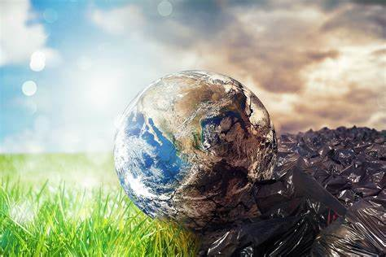

# ¿Qué es la contaminación ambiental?

La contaminación ambiental se puede definir como la destrucción del medioambiente debido a la introducción excesivo de sustancias y elementos físicos que alteran la naturaleza de manera drástica. Esto hace que las condiciones ambientales sean alteradas de una manera negativa para la vida terrestre. La principal fuente de esta anomalía el la manera de vivir del ser humano, gastos ineficientes, exceso de producción o algunos factores como la obsolescencia programda han llevado a que la naturaleza sea un vertedero humano.

---------------------------------------------------------------------------------------------------------------------------

