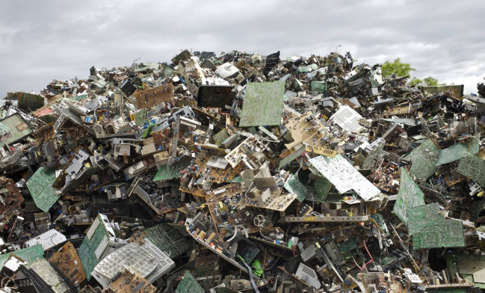

# Residuos Informáticos

Los residuos informáticos es uno de los grandes retos ambientales a nivel mundial advierte [The Global E-waste Monitor](https://www.itu.int/en/ITU-D/Environment/Pages/Publications/The-Global-E-waste-Monitor-2024.aspx), la introducción repentina de la "era digital" nos ha hecho prescindir totalmente de nuestros dispositivos electrónicos, esto ha conllevado a que se desate una crisis silenciosa que amenaza con desbordar nuestro planeta.

En 2022 se generaron 62.000 millones de kg de residuos electrónicos, esta crecida exponencial de residuos por año hace que el reciclaje formal no tenga tiempo para prepararse, en 2022 solo 13.800 millones de kg fueron documentados como recogidos y recliclados formalmente.

Esto demuestra que aún existen grandes brechsa y desafíos en cuanto a la gestión, sin embargo, cabe destacar que se ha percibido un aumento considerable del interés y la inversión en tecnologías para la gestión de residuos electrónicos.

Empresas como [Back Market](https://www.backmarket.es/es-es) apuestan por un modelo de economia circular, el reacondicionamiento de los dispositivos, esto puede incluirse como un método para reducir los residuos informáticos además de ser una alternativa mas económica.

